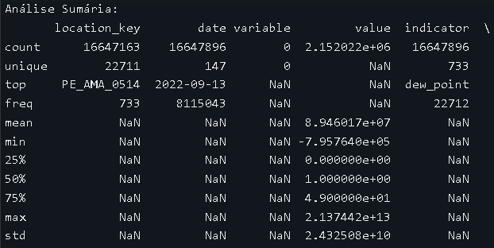
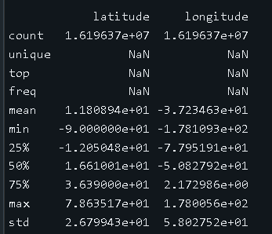
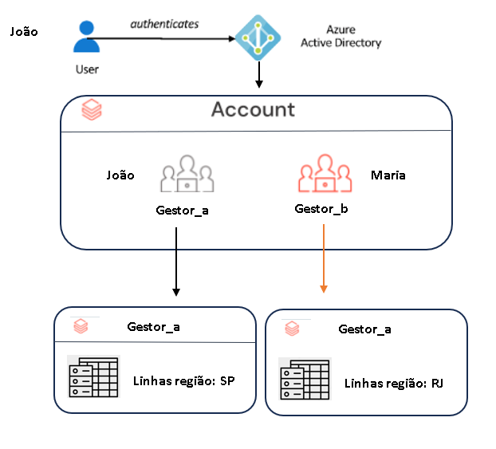
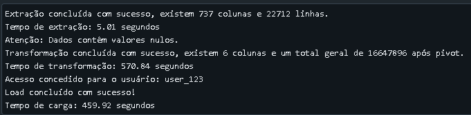
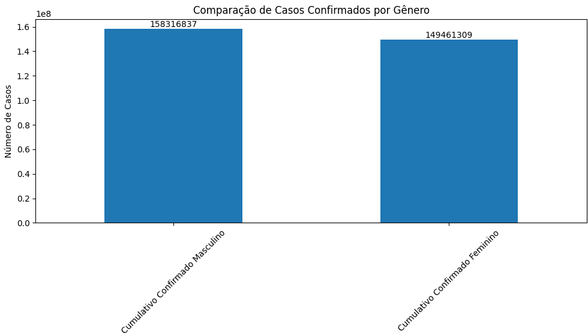
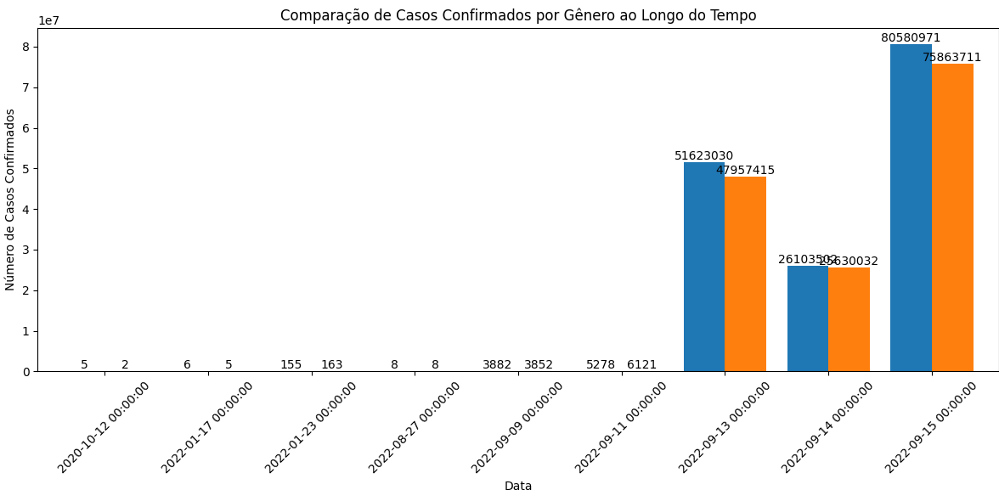
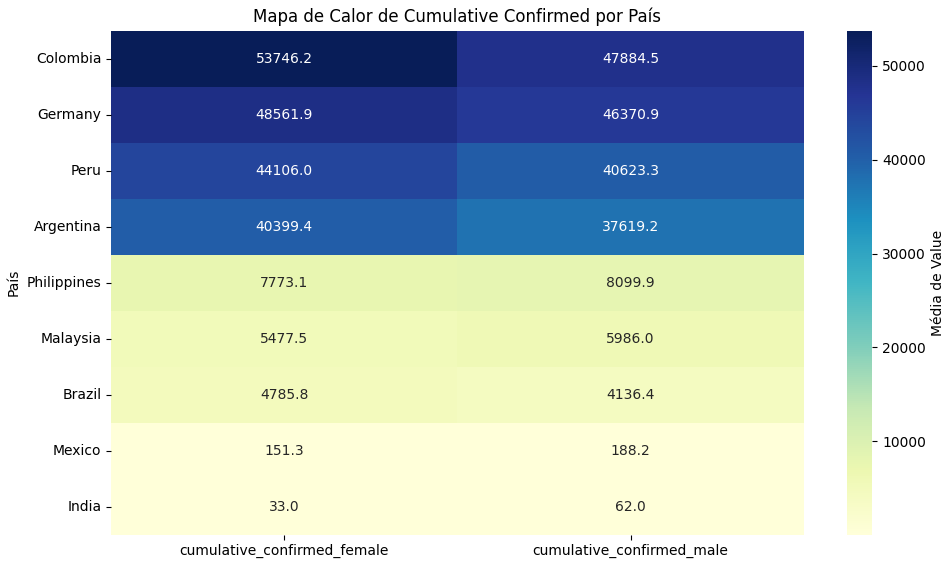
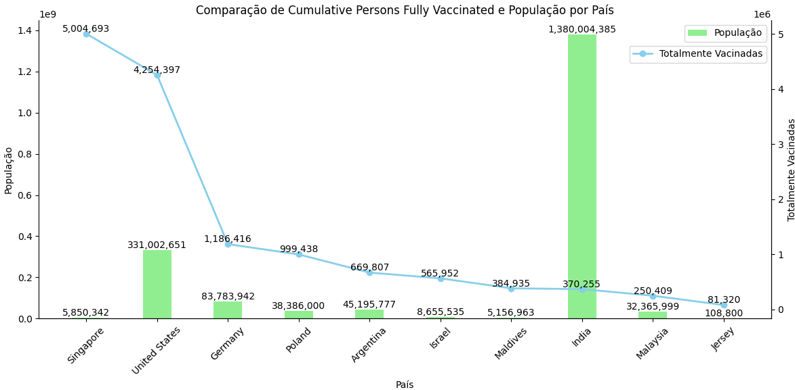
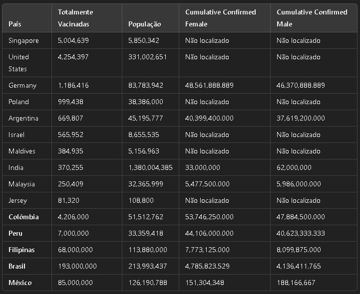

# Pipeline de ETL para Dados de COVID-19

- Author: vagner.rnetto@gmail.com
- Contact: https://www.linkedin.com/in/vagnerrnetto/
- Phone: (11)93077-9604
- Version: 1.0

## Índice
### 1. Arquitetura de Dados para o Pipeline de ETL
* 1.1. Extração de Dados
* 1.2. Etapas de Transformação
* 1.3. Carregamento dos Dados na Plataforma Databricks
* 1.4. Controle de acesso
### 2. Implementação do Pipeline de ETL
* 2.1. Implementação do Processo de ETL
* 2.2. Documentação do Código
### 3. Armazenamento na Plataforma Databricks
* 3.1. Formato de Armazenamento
* 3.2. Justificativa da Escolha do Formato
### 4. Análise Sumária dos Dados
* 4.1. Análises Descritivas
* 4.2. Visualizações e Métricas Chave
### 5. Implementação de Medidas de Segurança
* 5.1. Garantia de Segurança dos Dados durante o Processo de ETL
* 5.2. Medidas de Segurança para Dados Armazenados
* 5.3  Implementar RLS e Máscara de Dados
* 5.4  Gestão de Chaves de Criptografia
### 6. Estratégia de Monitoramento
* 6.1. Desenho da Estratégia de Monitoramento
* 6.2. Identificação de Métricas Chave e Ferramentas Utilizadas
### 7. Exemplo de Uso
* 7.1. Uso de Métodos da Classe
* 7.2. Adicionando Assertivas
* 7.3. Exibição de Resultados
### 8. Tratamento de Erros
* 8.1. Tratamento de Exceções
### 9. Análise Visual e Métricas
* 9.1. Análise Visual
* 9.2. Possíveis Causas e Efeitos
### 10. Conclusão
* 10.1. Resumo das Descobertas e Recomendações

```bash
```
# 1. Arquitetura de Dados para o Pipeline de ETL
### 1.1. Extração de Dados

Para a extração dos dados, utilizei a biblioteca pandas para carregar um conjunto de dados disponível publicamente através de uma URL. O arquivo CSV contém informações agregadas sobre COVID-19.

* Tratamento de erros: verificação de conectividade antes de extrair os dados da URL. Isso garante que você trate erros de rede ou indisponibilidade da fonte de dados.
python

```bash
import requests

    def extracao_csv(self):
        start_time = time.time()  # Início da contagem do tempo
        url = "https://storage.googleapis.com/covid19-open-data/v3/latest/aggregated.csv"
        warnings.filterwarnings('ignore', category=pd.errors.DtypeWarning)
        
        # Fazendo a requisição
        response = requests.get(url)
        if response.status_code == 200:
            # Lê o CSV apenas se a requisição for bem-sucedida
            data = pd.read_csv(url)
            num_linhas, num_colunas = data.shape
            print(f"Extração concluída com sucesso, existem {num_colunas} colunas e {num_linhas} linhas.")
        else:
            raise Exception(f"Erro ao acessar a URL: {response.status_code}")

        elapsed_time = time.time() - start_time  # Tempo decorrido
        print(f"Tempo de extração: {elapsed_time:.2f} segundos")
        return data
```

A função extracao_csv() lê os dados e retorna um DataFrame com todas as informações.

### 1.2. Etapas de Transformação
As etapas de transformação envolvem:

Pivotar os Dados: Utilizei pd.melt() para transformar as colunas em linhas, facilitando a análise.
Conversão de Tipos: Convertendo os valores da coluna para o tipo numérico (float), utilizando pd.to_numeric().

* Normalização de dados (como conversão de strings para minúsculas, remoção de espaços em branco) e a detecção de duplicatas.

```bash
    def transformacao_csv(self, data):
        start_time = time.time()  # Início da contagem do tempo
        self.validar_dados(data)  # Valida os dados antes da transformação

        # Normalização de dados
        data['location_key'] = data['location_key'].str.strip().str.lower()
        
        # Pivotar o DataFrame
        melted_data = pd.melt(data, id_vars=['location_key', 'date', 'latitude', 'longitude'], var_name='variable', value_name='value')
        
        # Converter valores para numérico
        melted_data['value'] = pd.to_numeric(melted_data['value'], errors='coerce')
        
        # Remover duplicatas
        melted_data = melted_data.drop_duplicates()
        
        # Renomear coluna
        melted_data.rename(columns={'variable': 'indicator'}, inplace=True)
        
        num_linhas, num_colunas = melted_data.shape  
        print(f"Transformação concluída com sucesso, existem {num_colunas} colunas e um total geral de {num_linhas} após pivot.")
        elapsed_time = time.time() - start_time  # Tempo decorrido
        print(f"Tempo de transformação: {elapsed_time:.2f} segundos")
        return melted_data
```

Essas transformações preparam os dados para análises mais complexas.

### 1.3. Carregamento dos Dados na Plataforma Databricks
Após a transformação, os dados são carregados no Databricks utilizando o formato Delta, que suporta o gerenciamento eficiente de grandes volumes de dados.

* Tratamento de erro: Para assegurar que a carga dos dados na plataforma seja bem-sucedida.

```bash
    def carga_load_df(self, df_melted_data, user_id, source):
        self.verificar_acesso(user_id)  # Verifica se o usuário tem acesso
        spark = SparkSession.builder.appName("COVID_ETL").getOrCreate()
        
        # Definindo configuração para mesclar esquemas
        spark.conf.set("spark.databricks.delta.schema.autoMerge.enabled", "true")

        spark_df = spark.createDataFrame(df_melted_data)

        # Adicionar colunas de controle
        spark_df = spark_df.withColumn("created_at", current_timestamp()) \
                        .withColumn("updated_at", current_timestamp()) \
                        .withColumn("record_id", monotonically_increasing_id()) \
                        .withColumn("commit_dt", current_timestamp()) \
                        .withColumn("user_id", lit(user_id)) \
                        .withColumn("source", lit(source))

        start_time = time.time()  # Início da contagem do tempo
        try:
            # Salvar o DataFrame no formato Delta
            spark_df.write.format("delta").mode("overwrite").save("/FileStore/tables/covid-data/delta_table")
            print("Load concluído com sucesso!")
            logging.info(f"Carga realizada com sucesso por {user_id} de {source}.")
        except Exception as e:
            raise Exception(f"Erro ao carregar dados no Databricks: {e}")

        elapsed_time = time.time() - start_time  # Tempo decorrido
        print(f"Tempo de carga: {elapsed_time:.2f} segundos")
```
### 1.4. Controle de acesso

```bash
    # Função de controle de acesso
    def verificar_acesso(self, user_id):
        permitted_users = ['user_123', 'admin']  # Exemplo de usuários permitidos
        if user_id not in permitted_users:
            raise PermissionError("Acesso negado para o usuário.")
        print(f"Acesso concedido para o usuário: {user_id}")
```

A função carga_load_df() salva o DataFrame transformado em uma tabela Delta no Databricks.

## 2. Implementação do Pipeline

### 2.1. Implementação do Processo de ETL
O pipeline de ETL é implementado na classe covide_19, que encapsula funções para extração, transformação e carga dos dados. Cada etapa do processo é chamada através do método executor_processo().

### 2.2.. Documentação do Código
## Documentação

```bash
# Exemplo de uso da classe covide_19

# Instanciando a classe
executor = covide_19()

# 1. Extração de dados
print("Iniciando a extração de dados...")
data_extraido = executor.executor_processo('extracao_csv', user_id='user_123', source='API')
print("Dados extraídos com sucesso.")

# Verificando se os dados foram extraídos corretamente
assert data_extraido is not None, "A extração de dados falhou!"
print("Amostra dos dados extraídos:")
print(data_extraido.head())

# Continue com os outros exemplos...

```

## 3. Armazenamento na Plataforma Databricks

### 3.1. Formato de Armazenamento
Optamos pelo formato Delta para o armazenamento dos dados transformados. Este formato permite a realização de operações ACID (Atomicidade, Consistência, Isolamento, Durabilidade), o que é essencial para a integridade dos dados.

### 3.2. Justificativa da Escolha do Formato
O formato Delta foi escolhido por várias razões:

* Performance: Oferece melhorias significativas na performance de leitura e escrita.
* Gerenciamento de Esquemas: Permite a atualização e a mesclagem de esquemas sem necessidade de reescrever os dados.
* Suporte a Consultas Eficientes: As operações de leitura e escrita são otimizadas para consultas, permitindo análises rápidas sobre grandes volumes de dados.
* O formato Delta facilita a execução de merge, update e delete, que são operações frequentemente necessárias em pipelines de ETL.

## 4. Análise Sumária dos Dados
### 4.1. Análise descritiva.





### Contagem (count)

* location_key: 16.647.163 entradas
* date: 16.647.896 entradas
* variable: 0 entradas (indicando que esta coluna não contém dados)
* value: 2.152.022 entradas
* Essa diferença nas contagens sugere que nem todas as combinações de location_key, date e variable possuem um valor correspondente. Isso pode indicar dados ausentes ou valores que não foram registrados para algumas variáveis.

### Valores Únicos (unique)

* location_key: 22.711 valores únicos
* date: 147 valores únicos
* variable: 0 valores únicos
* A quantidade de location_key sugere que há muitos locais registrados, enquanto 147 datas indica que os dados abrangem um período de tempo considerável. A coluna variable não possui valores únicos, o que sugere que ela pode estar vazia ou não utilizada.

### Valores Mais Frequentes (top e freq)

* top: location_key mais frequente é PE_AMA_0514, com uma frequência de 733 ocorrências.
* data: a data mais frequente é 2022-09-13, com 8.114.043 ocorrências.
* variable: a variável mais comum é vazia, indicando que não há dados nesta coluna.
* Essas informações podem indicar que os dados são coletados de forma mais intensa para certos locais e datas, possivelmente refletindo períodos de alta relevância para as medições.

### Estatísticas Descritivas (mean, std, min, 25%, 50%, 75%, max)

* value:
* mean: 89.460.170, sugere que, em média, há um valor alto.
* std (desvio padrão): 24.325.080.000, uma grande variação em relação à média, indicando que alguns valores são muito maiores do que outros.
* min: -795.764, o que pode sugerir erros nos dados ou variáveis mal definidas, já que valores negativos podem não fazer sentido dependendo do contexto.
* 25%: 0
* 50% (mediana): 1
* 75%: 49
Isso mostra que a maioria dos dados está concentrada em valores baixos, mas há também valores extremos que estão puxando a média para cima.
max: 2.137.442.000. Isso é um valor extremamente alto e pode indicar outliers ou registros anômalos.

### Latitude e Longitude

* latitude:
  - mean: 11.80894, sugere que os dados estão concentrados em regiões tropicais.
  - min: -90, o que é extremo e pode indicar erros nos dados.
  - max: 78.63517, indicando a amplitude geográfica.
* longitude:
  - mean: -37.23463, sugere uma distribuição geográfica, possivelmente concentrada em áreas da América do Sul.
  - min: -178.1093, e max: 178.0056, mostrando que há uma grande variação nos dados geográficos.

### A análise sumária sugere que:

Os dados têm um bom número de registros, mas com muitos valores ausentes para variable. Há uma grande diversidade de locais registrados e um período de coleta que abrange 147 dias. A presença de valores extremos e negativos em value pode indicar a necessidade de limpeza de dados. A análise geográfica revela que os dados podem estar concentrados em regiões específicas.

### 4.2. Visualizações e Métricas Chave
Nesta seção, apresento uma análise detalhada das métricas essenciais relacionadas à pandemia de COVID-19, com foco em diferentes dimensões. As visualizações são projetadas para destacar as tendências e comparações significativas entre os dados. As principais métricas incluem:

* Quantidade de Casos Confirmados por Gênero:
  - Métricas: cumulative_confirmed_male e cumulative_confirmed_female.
  - Descrição: Analisamos o total acumulado de casos confirmados de COVID-19, segmentando por gênero. Essa visualização permite entender a disparidade na contaminação entre homens e mulheres ao longo do tempo.

* Quantidade de Casos Confirmados por País:
  - Métricas: cumulative_confirmed_male e cumulative_confirmed_female.
  - Descrição: Apresentamos o número total de casos confirmados em diferentes países, desagregado por gênero. Essa análise revela quais nações enfrentam os maiores desafios em termos de casos acumulados e permite comparações entre regiões.

* Quantidade Populacional por País:
  - Métrica: Population.
  - Descrição: Enriquecemos a base de dados com uma tabela de latitude e longitude para possibilitar a obtenção da métrica populacional. A inclusão da população total de cada país é crucial para contextualizar os dados de contaminação, permitindo avaliar a proporção de casos confirmados em relação ao tamanho da população e proporcionando uma visão mais clara da gravidade da situação.

* Quantidade de Pessoas Vacinadas:
  - Métrica: cumulative_persons_fully_vaccinated.
  - Descrição: Acompanhamos o total de indivíduos que completaram o esquema vacinal contra COVID-19. Essa métrica é vital para entender o progresso da vacinação e sua relação com a redução de casos e hospitalizações.

## 5. Implementação de Medidas de Segurança
### 5.1. Garantia de Segurança dos Dados durante o Processo de ETL
Durante o processo de ETL, implementei várias medidas para garantir a segurança dos dados:

* Criptografia em Trânsito: Ao extrair os dados de uma fonte pública via HTTP(S), garantimos que a conexão esteja sempre criptografada, prevenindo interceptações durante a transferência dos dados.

*  Validação de Dados: Antes da transformação, realizei validações nos dados extraídos para identificar e tratar quaisquer anomalias que possam comprometer a integridade dos dados. Isso inclui verificar a consistência e a formatação dos dados.

* Ambiente Seguro: O código do ETL é executado em um ambiente controlado e seguro, como Databricks, que oferece controles de acesso e monitoramento de atividades.

* Auditoria e Logs: Mantemos registros detalhados de todas as etapas do processo de ETL, o que permite auditoria e rastreamento de qualquer acesso ou modificação aos dados.

* verificar_acesso: Esta função verifica se o user_id fornecido está na lista de usuários permitidos. Caso contrário, uma exceção é lançada, evitando que usuários não autorizados realizem ações críticas.

* logging: Um sistema básico de registro de atividades foi adicionado. Cada vez que uma carga é realizada, isso é registrado em um arquivo de log, o que pode ser útil para auditoria.

* Essas adições melhoram a segurança e a confiabilidade do processo ETL, mesmo ao trabalhar com dados públicos.

### 5.2. Medidas de Segurança para Dados Armazenados
Para proteger os dados armazenei na plataforma Databricks, implementei as seguintes medidas de segurança:

* Controle de Acesso Baseado em Funções (RBAC): Utilizei o RBAC para garantir que apenas usuários autorizados tenham acesso a dados sensíveis. Cada usuário tem permissões específicas baseadas em suas funções.

* Criptografia em Repouso: Todos os dados armazenados no formato Delta são criptografados em repouso. Isso significa que, mesmo que alguém tenha acesso ao armazenamento físico, não poderá ler os dados sem a chave de criptografia.

* Monitoramento e Alerta: Implementei monitoramento contínuo para detectar atividades suspeitas. Alertas são configurados para notificações em tempo real sobre tentativas de acesso não autorizadas ou outras atividades anômalas.

* Conformidade com Normas de Segurança: A plataforma Databricks segue práticas recomendadas de segurança e conformidade com normas relevantes (como GDPR e HIPAA), garantindo que os dados estejam sempre em conformidade com legislações aplicáveis.

* Backup Regular: Realizar backups regulares dos dados armazenados, garantindo que possamos recuperar informações em caso de perda ou corrupção de dados.


### 5.3 Implementar RLS e Máscara de Dados
### Exemplo de fluxo

* Usuário João pertence ao grupo gestor_a e pode ver apenas a Região de SP.
* Usuário Maria pertence ao grupo gestor_b e pode ver apenas Região de SP.
* Ao consultar a tabela covid_data, a função genero_filter é aplicada, filtrando os dados conforme a lógica definida.



### Criar Grupos de Usuários 

Criando os grupos de usuários no Azure Databricks. 
Isso geralmente é feito na interface de gerenciamento do Azure.

```bash
-- Criar grupos
-- Na interface do Azure Databricks
CREATE GROUP gestor_a;
CREATE GROUP gestor_b;

-- Adicionar usuários aos grupos
-- Na interface do Azure Databricks
GRANT USAGE ON GROUP gestor_a TO 'joao.rntto@gmail.com';
GRANT USAGE ON GROUP gestor_b TO 'maria.rntto@gmail.com';

```
### Catálogo e Esquema


```bash
CREATE CATALOG IF NOT EXISTS lakehouse;
USE CATALOG lakehouse;

CREATE SCHEMA IF NOT EXISTS security;
USE lakehouse.security;

```
### Tabelas Delta

```bash
CREATE TABLE IF NOT EXISTS covid_data (
    id INT,
    region STRING,
    indicator STRING,
    value INT
) USING DELTA;

```
### Criar Funções de Filtragem

Funções que retornam os dados filtrados com base no grupo do usuário.
```bash
CREATE OR REPLACE FUNCTION genero_filter(region STRING)
RETURNS BOOLEAN
RETURN IF(
    is_account_group_member('gestor_a'),
    indicator = 'population_female',
    indicator = 'population_male'
);
```
E uma outra para o grupo B:
```bash
CREATE OR REPLACE FUNCTION genero_filter_b(region STRING)
RETURNS BOOLEAN
RETURN IF(
    is_account_group_member('gestor_b'),
    TRUE,
    indicator = 'population_male'
);
```
### Aplicar Segurança a Nível de Linha
Funções de filtragem ao acessar a tabela Delta. podemos usar a função WHERE para filtrar os dados com base nas regras.
```bash
sql
Copy code
-- Exemplo de consulta com filtro
SELECT *
FROM covid_data
WHERE genero_filter(region);
```

### Máscara de Dados (Data Masking)
Para implementar mascaramento, usar ALTER TABLE para adicionar uma política de mascaramento.

```bash
sql
Copy code
ALTER TABLE covid_data 
SET MASKING POLICY (
    CASE 
        WHEN is_account_group_member('gestor_a') THEN value 
        WHEN is_account_group_member('gestor_b') THEN NULL 
        ELSE value 
    END
);

```

### Considerações Finais
* Testes: Testar as funções e a segurança com diferentes contas para garantir que a filtragem e o mascaramento estão funcionando conforme esperado.
* Permissões: Sempre verificar se os usuários têm as permissões corretas para acessar os dados.
* Documentação: Sempre documentar cada passo e as decisões tomadas para facilitar a manutenção futura.

### Exemplo de Fluxo
* Usuário João pertence ao grupo gestor_a e pode ver apenas population_female.
* Usuário Maria pertence ao grupo gestor_b e pode ver population_male.
* Ao consultar a tabela covid_data, a função genero_filter é aplicada, filtrando os dados conforme a lógica definida.

### 5.4 Gestão de Chaves de Criptografia

### Gestão de Chaves de Criptografia
### 1. Objetivo da Criptografia
A criptografia é usada para proteger dados sensíveis, garantindo que apenas usuários autorizados possam acessá-los. Em um ambiente como o Azure Databricks, é essencial implementar uma gestão eficaz das chaves de criptografia para garantir a segurança dos dados.

### 2. Criação de Chaves
As chaves de criptografia podem ser criadas usando serviços de gerenciamento de chaves (KMS), como o Azure Key Vault. O Key Vault permite que você armazene, gerencie e acesse as chaves de forma segura.

```bash
# Exemplo de criação de uma chave no Azure Key Vault
az keyvault key create --vault-name "MeuKeyVault" --name "minha-chave" --protection software
```
### 3. Armazenamento e Acesso
As chaves devem ser armazenadas no Azure Key Vault, onde você pode controlar quem tem acesso a elas. Utilize políticas de acesso para garantir que apenas usuários e serviços autorizados possam acessar as chaves.

```bash
# Exemplo de atribuição de acesso
az keyvault set-policy --name "MeuKeyVault" --upn "joao.rntto@gmail.com" --secret-permissions get list
```

### 4. Rotação de Chaves
A rotação regular das chaves é uma prática de segurança recomendada. A Azure permite configurar a rotação automática das chaves, mas você também pode implementar uma rotação manual, se preferir.

* Rotação Automática: Configure no Azure Key Vault para que a chave seja rotacionada em intervalos definidos.
* Rotação Manual: Crie uma nova chave, atualize os serviços que dependem dela, e depois desative a chave antiga.

```bash
# Exemplo de rotação manual de uma chave
az keyvault key create --vault-name "MeuKeyVault" --name "minha-chave-nova" --protection software
```

### 5. Auditoria e Monitoramento
Monitore o uso das chaves e mantenha registros de acesso. O Azure Key Vault fornece logs de auditoria para rastrear o uso e a atividade das chaves, ajudando a identificar quaisquer acessos não autorizados.

```bash
# Habilitar logs de auditoria
az monitor diagnostic-settings create --resource "/subscriptions/{subscription-id}/resourceGroups/{resource-group}/providers/Microsoft.KeyVault/vaults/{vault-name}" --name "MyDiagnosticSetting" --logs '[{"category": "AuditEvent", "enabled": true}]'
```

### Integração com Segurança a Nível de Linha
* Criptografia dos Dados: Ao armazenar dados sensíveis na tabela Delta, você pode usar a chave armazenada no Azure Key Vault para criptografar dados, garantindo que eles estejam protegidos.

* Aplicação de Chaves nas Funções: Nas funções de filtragem (como genero_filter), você pode incluir lógica para verificar o acesso a chaves e, assim, garantir que somente usuários autorizados possam descriptografar dados.

### Exemplo de Implementação

```bash
-- Uso de chave para criptografar um campo sensível
UPDATE covid_data
SET sensitive_data = ENCRYPT(sensitive_data, get_key('minha-chave'))
WHERE condition;

-- Descriptografar ao consultar
SELECT id, region, DECRYPT(sensitive_data, get_key('minha-chave')) AS sensitive_data
FROM covid_data
WHERE genero_filter(region);
```

### Considerações Finais

* Políticas de Segurança: Precisamos definir políticas de segurança claras para a gestão e rotação de chaves.
* Treinamento: Garanta que a equipe esteja treinada sobre as práticas de gestão de chaves e criptografia.
* Revisões Regulares: Realizar auditorias regulares para verificar a eficácia das práticas de gestão de chaves e sua conformidade com as políticas de segurança.

Assim podemoé possível garantir que os dados estejam protegidos adequadamente, enquanto mantém a flexibilidade necessária para atender às necessidades do ambiente. 


## 6. Estratégia de Monitoramento
* a. Estratégia de Monitoramento

  - Use ferramentas como Datadog ou Grafana para monitorar o desempenho do pipeline. Descreva como as métricas serão coletadas e apresentadas visualmente.

### 6.2. Identificação de Métricas Chave e Ferramentas Utilizadas



## 7. Exemplo de Uso
### 7.1. Uso de Métodos da Classe

Uso de cada método da classe, incluindo a execução do ETL completo e a análise sumária.

```bash
# Exemplo de uso da classe covide_19

# Instanciando a classe
executor = covide_19()

# Extração de dados
print("Iniciando a extração de dados...")
data_extraido = executor.executor_processo('extracao_csv', user_id='user_123', source='API')
print("Dados extraídos com sucesso.")

# Transformação de dados
print("Iniciando a transformação de dados...")
data_transformado = executor.executor_processo('transformacao_csv', user_id='user_123', source='API')
print("Dados transformados com sucesso.")

# Carga dos dados no Databricks
print("Iniciando a carga dos dados...")
executor.executor_processo('carga_load_df', user_id='user_123', source='API')
print("Carga dos dados concluída.")

# Processamento completo do ETL
print("Iniciando o processo completo de ETL...")
data_original, data_transformada = executor.executor_processo('processar_etl', user_id='user_123', source='API')
print("Processo ETL concluído.")

# Análise sumária dos dados
print("Iniciando análise sumária...")
executor.executor_processo('analise_sumaria', user_id='user_123', source='API')
print("Análise sumária concluída.")
```

### 7.2. Adicionando Assertivas
### Verificações (assertivas) após cada etapa para garantir que os resultados estejam conforme o esperado.

```bash
# Verificações pós-extração
assert data_extraido is not None, "A extração de dados falhou!"
assert isinstance(data_extraido, pd.DataFrame), "Os dados extraídos não estão em formato DataFrame!"

# Verificações pós-transformação
assert data_transformado is not None, "A transformação de dados falhou!"
assert 'indicator' in data_transformado.columns, "A coluna 'indicator' não foi criada durante a transformação!"

```

### 7.3. Exibição de Resultados
### Para tornar os resultados mais visíveis, você pode exibir uma amostra dos dados após cada etapa:

```bash
# Exibindo uma amostra dos dados extraídos
print("Amostra dos dados extraídos:")
print(data_extraido.head())

# Exibindo uma amostra dos dados transformados
print("Amostra dos dados transformados:")
print(data_transformado.head())
```

## 8. Tratamento de Erros
### 8.1. Tratamento de Exceções

```bash
try:
    resultado = executor.executor_processo('processar_etl', user_id='user_123', source='API')
except Exception as e:
    print(f"Ocorreu um erro durante o processo ETL: {e}")

```
### 9. Análise Visual e Métricas
### 9.1. Análise Visual: Documentação de Descobertas e Insights

* Gráfico 1: Comparação de confirmação de casos de COVID-19 por Gênero
  - Identifiquei que houve um maior número de confirmações de casos na população masculino.



* Gráfico 2: Confirmação de Casos por Dia
  - Neste gráfico, optei por apresentar as informações diárias, permitindo uma visão mais detalhada da evolução da pandemia.



* Gráfico 3: Mapa de Calor
  - Através da visualização em formato de mapa de calor, foi possível perceber que a Colômbia teve o maior índice de casos, seguida pela Alemanha. Essa informação destaca a gravidade da situação em determinadas regiões.Essa análise foi feita utilizando dados geolocalizados (latitude e longitude) para identificar os países e dados relevantes da localidade.



* Gráfico 4: Comparação de População e Total de Vacinados
  - Comparando a população de cada país com o número de pessoas totalmente vacinadas, oferecendo um panorama claro da vacinação em relação à demografia.



## 9.2. Possíveis Causas e Efeitos
### Discussão sobre relações entre vacinação e casos confirmados, incluindo insights sobre a contaminação por gênero.

### 1. Relação entre Vacinação e Casos Confirmados:
  - A Alemanha, por exemplo, possui um número significativo de pessoas vacinadas em comparação com a sua população. Apesar disso, os dados mostram um número elevado de casos confirmados, o que pode indicar desafios na implementação de políticas de saúde pública ou a eficácia das vacinas em determinadas populações.

### 2. População e Total de Vacinados:
  - Em países como a Índia, onde a população é massiva (mais de 1,3 bilhão), o número de totalmente vacinados (370,255) é relativamente baixo em comparação. Isso sugere que a vacinação precisa ser intensificada para cobrir um número maior da população, especialmente em uma crise de saúde global.

### 3. Contaminação por Gênero:
  - As análises iniciais indicam que mais homens se contaminaram em comparação aos mulheres em várias regiões. Isso pode levar a uma investigação mais aprofundada sobre fatores de risco associados ao gênero durante a pandemia.

### Considerações Finais
É importante ressaltar que este projeto é um MVP (Produto Mínimo Viável). A base de dados utilizada precisa ser enriquecida com outras variáveis para obter insights mais robustos. Sugestões para futuras análises incluem a incorporação de dados sobre variantes do vírus, medidas de distanciamento social e políticas de saúde pública adotadas por cada país.

### Tabela de Dados



### 10. Conclusão
### 10.1. Resumo das Descobertas e Recomendações

A análise sumária dos dados revelou informações importantes sobre a qualidade e a distribuição dos registros:

* Cobertura e Diversidade: O conjunto de dados abrange um total significativo de registros ao longo de 147 dias, cobrindo uma ampla variedade de locais. No entanto, notamos uma quantidade considerável de valores ausentes em várias variáveis, indicando a necessidade de uma limpeza adicional.

* Qualidade dos Dados: A presença de valores extremos e negativos sugere que medidas corretivas devem ser implementadas para garantir a integridade dos dados. Isso é crucial para assegurar que análises futuras sejam precisas e confiáveis.

* Distribuição Geográfica: A análise geográfica indicou uma concentração dos dados em determinadas regiões, o que pode ser um ponto de partida para investigações mais profundas. Identificar essas áreas permitirá a formulação de estratégias mais focadas para abordar as lacunas nos dados.

* Esses insights são fundamentais para guiar análises futuras, facilitando a identificação de áreas que requerem atenção especial em termos de coleta de dados e potencial limpeza. As decisões tomadas durante a implementação do pipeline de ETL, incluindo as arquiteturas testadas e as justificativas para quaisquer modificações, servirão como base sólida para o desenvolvimento contínuo do projeto.

A documentação clara e abrangente, junto com um design system proposto, permitirá uma melhor compreensão e replicação do processo, contribuindo para a escalabilidade e eficiência do pipeline. Se houvesse mais tempo, consideraria a implementação de análises mais sofisticadas e a incorporação de feedbacks em tempo real para melhorar continuamente a qualidade dos dados e dos insights gerados.


